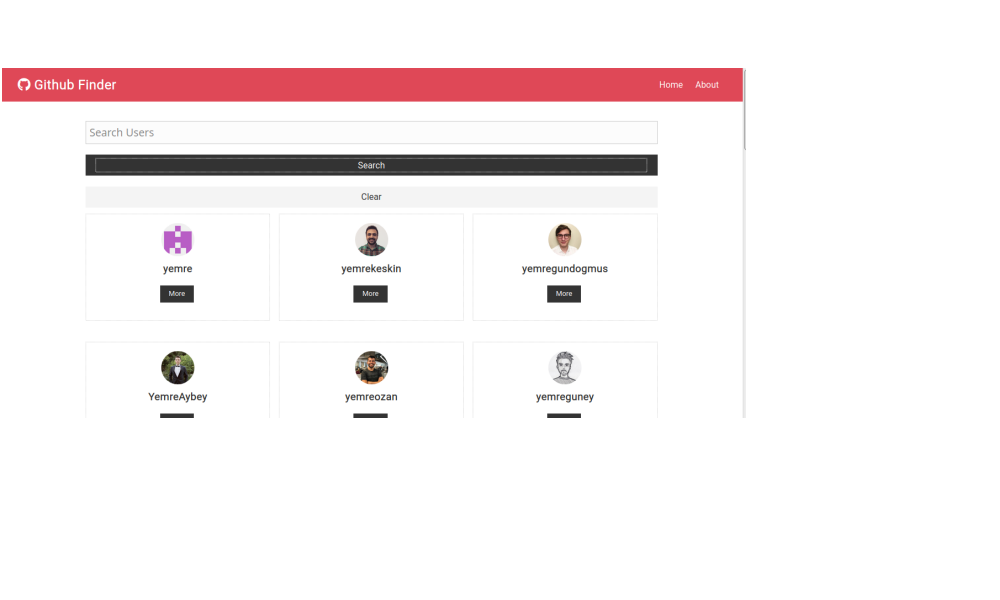
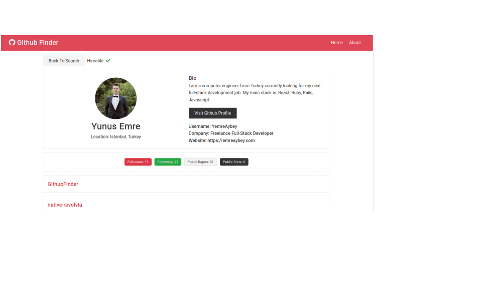

<h1 align="center">Github Finder 👋</h1>
<p>
  
  <a href="https://github.com/YemreAybey/GithubFinder#readme" target="_blank">
    
  </a>
  <a href="https://github.com/YemreAybey/GithubFinder/commit-activity" target="_blank">
    
  </a>
  <a href="https://twitter.com/YunusAybey" target="_blank">
    
  </a>
</p>

<p align="center">
    
    
</p>

<br>

This project is created by following the tutorial of [Brad Traversy](https://github.com/bradtraversy).
In this project, You can search for anyone who is using github. Check their profile or repos. You can see whether they are hireable or not.

## Built With

- React/Hooks
- JavaScript (ES6)
- Node.js
- npm
- Create-React-App
- CSS

### ✨ [Live Demo](https://emregithub-finder.netlify.com/)

## Usage

> Clone the repository to your local machine

```sh
$ git clone https://github.com/YemreAybey/GithubFinder.git
```

> cd into the directory, install dependencies, and start

```sh
$ cd basic-bookstore-redux
$ npm install
$ npm start
```

> Open `http://127.0.0.1:3000` using your favourite broswer, if it doesn't open automatically.

## Authors

👤 **Y.Emre AYBEY**

- Github: [@YemreAybey](https://github.com/YemreAybey)
- Twitter: [@YunusAybey](https://twitter.com/YunusAybey)

## 🤝 Contributing

Contributions, issues and feature requests are welcome!<br />Feel free to check [issues page](https://github.com/YemreAybey/GithubFinder/issues).

1. Fork it (https://github.com/YemreAybey/GithubFinder.git/fork)
2. Create your working branch (git checkout -b [choose-a-name])
3. Commit your changes (git commit -am 'what this commit will fix/add/improve')
4. Push to the branch (git push origin [chosen-name])
5. Create a new Pull Request

## Show your support

Give a ⭐️ if you like this project!
